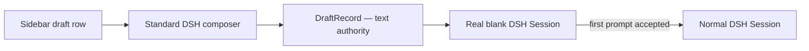

# dsh-draft-sessions

Persistent, unsent future conversations for [DeepSeek Harness](https://github.com/deepseek-ai/deepseek-harness).

`dsh-draft-sessions` is building the Cursor-like workflow where you can prepare several independent tasks, leave them unsent, and return to each task later without starting an agent.

> [!IMPORTANT]
> This repository is an early alpha. The durable draft lifecycle, composer bridge, and sidebar interactions are implemented. Release qualification across restarts, browsers, platforms, and supported DSH versions is still in progress.

[Русская версия](README.ru.md) · [Specification](SPEC.md) · [Architecture](docs/architecture.md) · [Roadmap](ROADMAP.md)

## The intended experience

```text
my-project
├─ ● Fix auth middleware
├─ ◌ Add Grafana dashboards       Draft
├─ ◌ Refactor docker entrypoint   Draft
└─ ● Implement notifications
```

Each draft owns a real blank DSH Session, but its unsent text is stored separately on the Host. If that blank Session disappears after a restart, a new shell can be created and rebound without losing the task.



## What works now

- Host-backed JSON persistence under `$DSH_HOME/storages/dsh-draft-sessions/drafts.json`.
- Strict typed `draftSessions.list/create/update/delete/rebind` Remote methods.
- Independent workspace ordering and a configurable per-workspace limit.
- Optimistic revisions that reject stale browser writes.
- Atomic same-directory writes and strict durable-file validation.
- Distinct blank Session creation with the id persisted only after success.
- Missing Session detection and recovery rebinding without changing draft text.
- Accepted-Send observation with finalization only after `blank: false`.
- Rejected Send and blank slash-command preservation.
- Exact composer restore through the official per-session InputHub facade.
- Debounced optimistic autosave with a mandatory pre-switch flush.
- `Ctrl/Cmd + Shift + N` creation in the current or recent Workspace.
- Muted draft rows before ordinary Sessions through the pinned upstream workspace browser.
- Inline rename, duplicate, confirmed delete, keyboard navigation, and bounded drag reorder.
- Safe active-draft deletion with a final autosave flush and recovery after a rejected delete.
- Compatibility fallback to the untouched upstream browser when replacement activation is unsafe.
- Unit and DOM coverage for persistence, concurrency, lifecycle, composer, and sidebar behavior.

The current implementation deliberately does not send prompts, modify ordinary Session history, or delete blank Sessions.

## Requirements

- Node.js `^22.19.0` or `>=24.0.0`
- pnpm 11
- DeepSeek Harness `next`, currently `>=0.1.0-rc.7 <0.2.0`

The `next` requirement is intentional: the plugin uses the current Typert Remote API published by DSH.

## Development

```bash
cd dsh-draft-sessions
pnpm install
pnpm check
```

Build and link the checkout into a Web profile:

```bash
pnpm build
dsh plugin --profile web add .
dsh --profile web --dump-config
```

For a GitHub installation, DSH also supports `dsh plugin --profile web add github:owner/dsh-draft-sessions`. Because Git dependencies build from source, pnpm will require the user to allow this package's `prepare` script. Prefer an npm release or packed tarball when you do not want install-time build permission.

Remove the linked package with:

```bash
dsh plugin --profile web remove dsh-draft-sessions
```

## Releases

Releases are built from existing `v`-prefixed SemVer tags by the manual [Release workflow](.github/workflows/release.yml). The workflow checks out the exact tag, runs the full quality gate, replaces the package version with the tag version, creates an npm tarball and SHA-256 checksum, smoke-tests a clean tarball install, uploads the workflow artifact, and creates a GitHub Release with generated notes.

Maintainers can start it from **Actions → Release → Run workflow**, or with GitHub CLI:

```bash
git tag -a v0.1.0-rc.1 -m "v0.1.0-rc.1"
git push origin v0.1.0-rc.1
gh workflow run release.yml -f tag=v0.1.0-rc.1 -f publish_npm=false
```

Prerelease tags publish to the npm `next` dist-tag; stable tags use `latest`. npm publication is disabled by default. To enable the opt-in publish job:

1. Bootstrap the package on npm if it has not been published before.
2. Configure npm trusted publishing for this GitHub repository, workflow filename `release.yml`, environment `npm`, and the `npm publish` action.
3. Create the protected GitHub environment named `npm`, then run the workflow with `publish_npm=true`.

The publish job uses GitHub OIDC instead of a long-lived npm token. A GitHub Release is always created before npm publication is attempted.

## Configuration

The bundle inserts the `draft-sessions` Cordis row. Override it from the profile patch when needed:

```yaml
- id: draft-sessions
  config:
    # Blank uses $DSH_HOME/storages/dsh-draft-sessions/drafts.json
    storagePath: ""
    maxDraftsPerWorkspace: 50
```

## Current API

```ts
await ctx.remote.draftSessions.list({ workspaceId });

await ctx.draftSessionLifecycle.create({
  workspaceId,
  text: "",
});

await ctx.draftSessionLifecycle.ensureShell(draft);

await ctx.draftComposerBridge.open(draft);
await ctx.draftComposerBridge.flush();

await ctx.draftShortcutController.create(workspaceId);

await ctx.remote.draftSessions.update({
  id,
  expectedRevision: 4,
  text: "Add OTEL export",
});

await ctx.remote.draftSessions.rebind({
  id,
  expectedRevision: 5,
  sessionId: replacementSessionId,
});
```

The lifecycle service owns blank Session creation and recovery. The lower-level Remote methods remain available for storage operations; all mutations return the next `revision`, and a stale `expectedRevision` is rejected instead of silently overwriting another browser's edit.

## Design boundaries

- Draft text is authoritative in `DraftStore`; a blank Session is only an execution shell.
- Creating a draft must never make a model request.
- The first accepted prompt, not the Send button click, is the conversion boundary.
- Ordinary DSH Sessions remain owned entirely by DSH.
- Attachments are out of scope for v1; text and textual `@file` references come first.
- The upstream workspace browser currently has no public row-extension seam, so exact sidebar integration requires a small, version-tracked replacement package.

See [SPEC.md](SPEC.md) for acceptance criteria and [docs/architecture.md](docs/architecture.md) for the lifecycle.

## Contributing

Issues and focused pull requests are welcome. Please read [CONTRIBUTING.md](CONTRIBUTING.md) and run `pnpm check` before submitting a change.

## License

[MIT](LICENSE)
